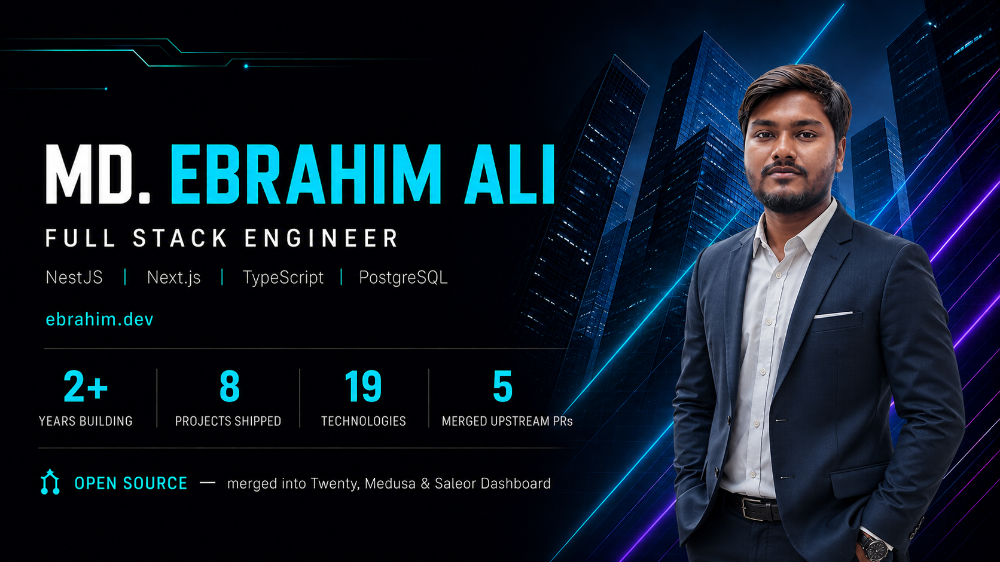

  

  
  
  

  

---

## What I do

I build the parts of a product that have to be right — catalogues, inventory, orders, payments and auth.

Right now that means a large-scale CRM and e-commerce platform, where I work across NestJS services, PostgreSQL schemas and Next.js interfaces. Most of what I actually do sits at the seams: the transaction boundary, the module edge, the schema that has to survive the next feature, the assumption nobody wrote down until it broke something in production.

**Currently** — Full Stack Engineer at RemoteIntegrity *(Clearwater, FL — remote)*

---

## Open source

I read an unfamiliar codebase until I can explain *why* a bug happens, then fix the cause rather than the symptom. Each of these was reviewed and merged by the project's own maintainers.

| Project | What was wrong | PR |
|---|---|---|
| **[Twenty](https://github.com/twentyhq/twenty)** `56k+ ★` | The MCP endpoint invented its own progress tokens and streamed notifications no client had requested — one report hit 157 protocol errors in a single session | [#24582](https://github.com/twentyhq/twenty/pull/24582) |
| **[Medusa](https://github.com/medusajs/medusa)** `36k+ ★` | An unawaited cache write let all four auth providers redirect users before their OAuth state was persisted, and crashed the process on a transient cache error | [#16571](https://github.com/medusajs/medusa/pull/16571) |
| **[Saleor Dashboard](https://github.com/saleor/saleor-dashboard)** | A crash across six list views, caused by row selections outliving their rows. Fixed in the grid rather than per view, settling three divergent behaviours across nine lists | [#6873](https://github.com/saleor/saleor-dashboard/pull/6873) |
| **[Saleor Dashboard](https://github.com/saleor/saleor-dashboard)** | Datagrid rows stopped behaving like links — no open-in-new-tab on right click, and middle click navigated in place, because the row anchor was positioned in document coordinates while the grid reports viewport ones | [#6868](https://github.com/saleor/saleor-dashboard/pull/6868) |
| **[Saleor Dashboard](https://github.com/saleor/saleor-dashboard)** | The Ctrl+K palette shipped combobox ARIA on an abstract role, so none of it applied — three critical axe-core violations, no visual change to fix | [#6858](https://github.com/saleor/saleor-dashboard/pull/6858) |
| **[Saleor Dashboard](https://github.com/saleor/saleor-dashboard)** | Discount reward values silently dropped their decimals — `12.55` saved as `12`, with no error shown | [#6860](https://github.com/saleor/saleor-dashboard/pull/6860) |

  <a href="https://ebrahim.dev/open-source"><b>Full write-ups — the bug, the cause, and why each fix was scoped that way →</b></a>

---

## Stack

  

**Languages** TypeScript · JavaScript · Python · SQL
**Backend** NestJS · Node.js · Express.js · Django · REST API design · domain-driven modules
**Frontend** Next.js · React · Tailwind CSS · Framer Motion
**Data** PostgreSQL · Prisma · MongoDB · Redis
**Infrastructure** Docker · CI/CD · Git

---

## Selected work

| Project | What it is | |
|---|---|---|
| **VELANO Fashion** | Production storefront and admin for a fashion brand — bKash, Nagad and COD payment flows, membership rewards, order tracking | [Live](https://velanobd.com) |
| **Zyplo** | Team workspace platform — workspace-scoped RBAC, activity analytics, structured documentation | [Live](https://zyplo-six.vercel.app) |
| **AssetVerse** | HR and asset management across three roles, with Stripe subscriptions and scoped route protection | [Live](https://eb-assetverse.vercel.app) · [Code](https://github.com/ebrahim2355/assetverse-client) |
| **ClubNest** | Community club and event platform with role-aware membership | [Live](https://clubnest-web.web.app) · [Code](https://github.com/ebrahim2355/clubnest-web) |

  <a href="https://ebrahim.dev/projects"><b>All projects, with problem statements and the decisions behind them →</b></a>

---

  <a href="https://ebrahim.dev"><b>ebrahim.dev</b></a>
  &nbsp;·&nbsp;
  <a href="https://www.linkedin.com/in/ebrahim235/">LinkedIn</a>
  &nbsp;·&nbsp;
  <a href="mailto:web.ebrahimali@gmail.com">web.ebrahimali@gmail.com</a>

